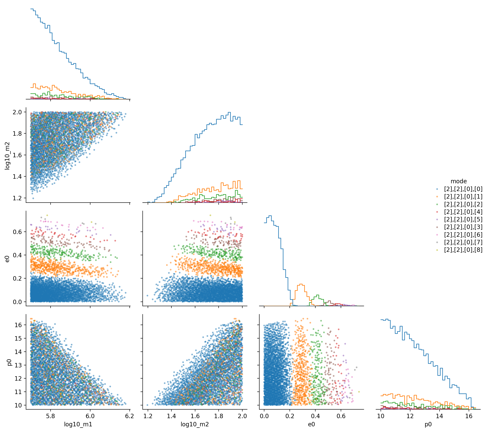

# map_modes — One‑Mode Mapping with FEW

This project explores regions of EMRI parameter space where **exactly one GW mode** survives an SNR threshold. It builds on [FastEMRIWaveforms (FEW)](https://github.com/BlackHolePerturbationToolkit/FastEMRIWaveforms) and produces both CSV data and visual summaries.

---

## Quickstart

```bash
uv sync
uv run python one_mode_map.py
```

Outputs:
- `one_mode_map.csv` — sampled points + surviving mode indices `(l,m,k,n)`
- `one_mode_map_corner_scatter.png` — corner plot (scatter off‑diagonal, histograms on diagonal)

---

## Example Output

A curated plot is stored under `docs/` for display:



The auto‑generated file `one_mode_map_corner_scatter.png` is `.gitignore`d to keep the repo lean.

---

## How it Works

1. Sobol sampling across the prior space $(\log_{10}M_1, \log_{10}M_2, e_0, p_0)$.
2. Evaluate per‑mode SNRs via FEW.
3. Keep points with exactly one mode above threshold.
4. Save surviving samples and mode indices.
5. Render a scatter‑corner plot: histograms on diagonal, colored scatters off‑diagonal.

---

## Dependencies

Core: `numpy`, `scipy`, `matplotlib`, `corner`, `tqdm`

Optional: `seaborn`, `pandas` (for PairGrid‑based plotting)

---

## Notes

- `fastemriwaveforms` is tracked as a dev dependency.
- A curated example plot is under `docs/`, while generated plots are ignored.

---

## Acknowledgments

- [FastEMRIWaveforms](https://github.com/BlackHolePerturbationToolkit/FastEMRIWaveforms)
- Scientific Python ecosystem
