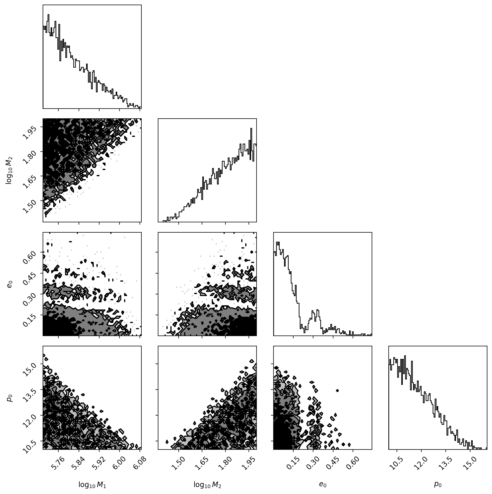

# one_mode_map — map 1‑mode regions for EMRI harmonics

This repo contains a small, self‑contained mapper that searches EMRI parameter space for regions where **exactly one spherical‑harmonic mode** exceeds a chosen **per‑mode SNR threshold** (default **SNR ≥ 17**), then visualizes the results in a **corner plot**.

Under the hood it uses **\[FastEMRIWaveforms (FEW)]**’s `FastSchwarzschildEccentricFlux` model and a LISA sensitivity curve (`LPA.txt`). Sampling is quasi‑uniform via a **Sobol** low‑discrepancy sequence, with optional **local refinement** (jitter) around discovered 1‑mode hits to trace boundaries.

---

## Features

* **1‑mode region mapping** over $(\log_{10} M_1, \log_{10} M_2, e_0, p_0)$ with a simple feasibility map $p_0 = 10 + u (6 + 2e_0)$ driven by a helper variable $u\in[0,1]$.
* **Per‑point evaluation** uses FEW with a PSD interpolant (edge‑clipped) and returns the **number of modes kept** by an absolute per‑mode SNR cut.
* **Sobol sampling** for even coverage + **refinement rounds** that jitter hits to outline boundaries.
* **Progress bars** (`tqdm`) for uniform and refine loops.
* **Corner plot** with **uniform‑only KDE/histograms** (to avoid boundary oversampling) and a **light refine overlay** so boundary structure is still visible.
* **Replot without re‑evaluation**: results are saved to CSV and can be reloaded for plotting.

---

## Quick start

> Requirements: Python ≥3.10. Dependencies are declared in `pyproject.toml`.

### Using **uv** (recommended)

```bash
# create/activate a local virtual env (optional; uv will create .venv on first sync)
uv venv

# install dependencies from pyproject/uv.lock (resolves if no lock yet)
uv sync

# run the mapper (edit settings inside the script first if needed)
uv run python one_mode_map.py
```

**Common uv tasks**

```bash
# add a new dependency (example)
uv add corner tqdm

# upgrade deps to latest compatible versions
uv lock --upgrade
uv sync
```

### Alternatively: pip/conda

```bash
# create/activate an environment
# conda create -n map-modes python=3.10 -y
# conda activate map-modes

# install deps (if you are not using uv)
pip install fastemriwaveforms numpy scipy matplotlib tqdm corner

# run
python one_mode_map.py
```

**Outputs** (prefix controlled by `SAVE_PREFIX`):

* `one_mode_map.csv` — all 1‑mode hits with provenance/weights
* `one_mode_map_corner.png` — corner plot of the 1‑mode region


## Example result



> The figure is produced by `one_mode_map.py` and saved as `<SAVE_PREFIX>_corner.png` (default: `one_mode_map_corner.png`). To replot without re‑evaluating FEW, keep `one_mode_map.csv` and set `REUSE_EXISTING=True`.

---

## File layout

* `one_mode_map.py` — main script (scanner + plotting + CSV IO)

---

## Configuration (inside `one_mode_map.py`)

### Observation / detection

* `DT_SEC` *(float)* — sampling interval (s)
* `T_YEARS` *(float)* — observation duration (yr)
* `THR_SNR` *(float)* — **absolute per‑mode SNR** threshold
* `DIST_GPC` *(float)* — source distance in Gpc (used by FEW and for scaling)
* `THETA`, `PHI` — fixed sky/polarization angles (radians)

### Parameter ranges

* `LOG10_M1_RANGE` — MBH mass range in log10 solar masses
* `LOG10_M2_RANGE` — CO mass range in log10 solar masses
* `e0_RANGE` — initial eccentricity $e_0$
* `U_RANGE` — helper $u\in[0,1]$ mapped to $p_0$ via `p0 = 10 + u*(6 + 2*e0)`

### Mapping controls

* `SCAN_SAMPLES` — number of **uniform** Sobol samples
* `SCAN_REFINE_ROUNDS` — number of **refine** passes
* `SCAN_REFINE_FRACTION` — fraction of current hits to jitter each refine round
* `SCAN_JITTER_SIGMA` — jitter `std` for `(log10_m1, log10_m2, u, e0)`

### Plotting & storage

* `SAVE_PREFIX` — output basename for CSV/fig
* `REUSE_EXISTING` — if `True`, load CSV and **replot only**
* `PLOT_UNIFORM_ONLY_DENSITY` — if `True`, corner KDE/hists use only uniform hits
* `REFINE_KDE_WEIGHT` — refine weight if you choose to include refine in KDE
* `REFINE_OVERLAY_ALPHA` — transparency for refine **overlay** scatter

---

## What the CSV contains

The script saves (and reloads) a single CSV with columns:

```
log10_m1,log10_m2,u,e0,p0,is_refine,w
```

* `log10_m*` — used for plotting
* `m*` — convenience in linear mass
* `is_refine` — `0` uniform hit, `1` refine hit
* `w` — plotting weight (1.0 for uniform, `REFINE_KDE_WEIGHT` for refine)

> **Tip:** You can edit the CSV and re-run with `REUSE_EXISTING=True` to quickly iterate on plots without re-evaluating FEW.

---

## How it works (brief)

1. **PSD & sensitivity**: loads `LPA.txt` via FEW’s file manager and builds a `CubicSplineInterpolant`. A tiny wrapper clamps out‑of‑range frequency queries to **silence OOB warnings** while still using edge values.
2. **Sampling**: generates `SCAN_SAMPLES` Sobol points over the prior box.
3. **Evaluate**: each point is called through FEW; if the **number of kept modes** equals `1`, it’s retained.
4. **Refine**: optionally jitter a subset of hits for a few rounds to map the boundary.
5. **Save**: append points to CSV with provenance/weights.
6. **Plot**: build a corner plot: **uniform hits drive the density**; refine hits are **faint overlay**.

---

## Usage patterns

* **Fresh map**: set `REUSE_EXISTING=False`, tweak `SCAN_*`, and run.
* **Replot only**: set `REUSE_EXISTING=True` (default) and re-run to update styling quickly.
* **Bias control**: keep `PLOT_UNIFORM_ONLY_DENSITY=True` to avoid density artifacts from refinement. If you want refine to contribute a bit, set it to `False` and tune `REFINE_KDE_WEIGHT` (e.g., `0.1`).

---

## Performance notes

* FEW calls dominate runtime. Start with smaller `SCAN_SAMPLES` (e.g., 5–20k) and increase as needed.
* Refinement is great for **boundary discovery**; it should not dominate the KDE (hence the plotting weights).
* The script uses an `lru_cache` on the evaluator so revisits due to jitter don’t recompute.

---


## Roadmap / nice‑to‑haves

* Mode‑robustness metrics on hits (e.g., top‑two SNR gap, power fraction) and coloring overlays by winning `(ℓ,m,k,n)`.
* Coarse‑to‑fine evaluation (cheap FEW config for scanning, verify hits with fine settings).
* Color-code the different modes to see if it's always the 2-2 mode or not.

---

## Acknowledgments

* **FastEMRIWaveforms (FEW)** for the waveform engine and LISA sensitivity utilities.

---

## Citation

If you use this code in a publication, please cite FEW accordingly and include a link to this repository.
